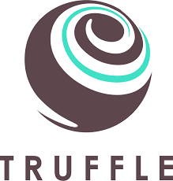
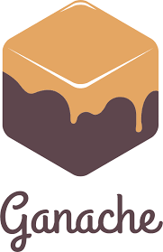

# Chat Hub
A blockchain chat app is a decentralized messaging platform that leverages blockchain technology to provide secure, private, and tamper-proof communication. Unlike traditional chat applications that rely on centralized servers, blockchain chat apps store messages and user data on a distributed ledger, ensuring data integrity, end-to-end encryption, and user control over their information.

## Stack
|  |    |  |
|---|---|---|
  
## UI    


## Deploy
You first need to run Ganache on localhost:7545, install metamask in the browser, install dependencies and finally fire the react server.
```
npm install
npm run start
truffle mitigate
set NODE_OPTIONS=--openssl-legacy-provider && npm start
```

## Features
* End-to-end encryption for privacy and security.
* Decentralized architecture to eliminate single points of failure.
* A versatile mode of communication through Smart Contacts.
* Identity verification through cryptographic keys.
* Tracking token-based incentives or microtransactions for user engagement or premium services.

